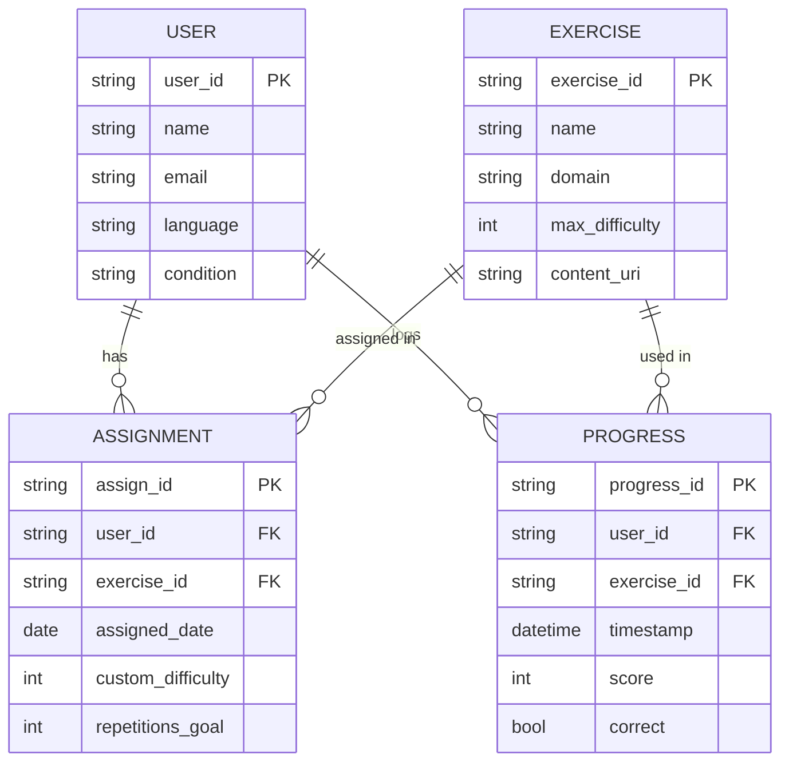
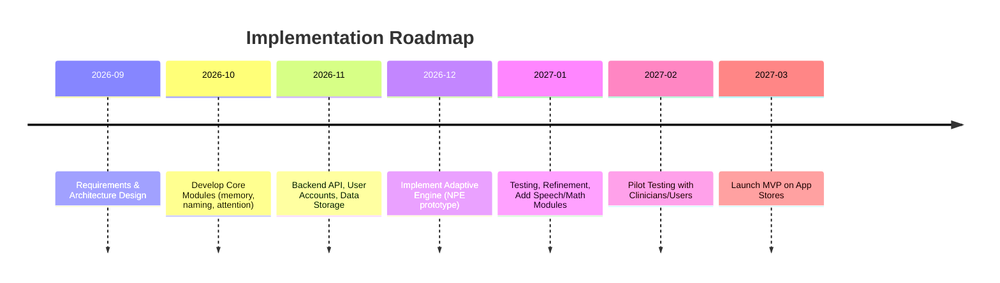
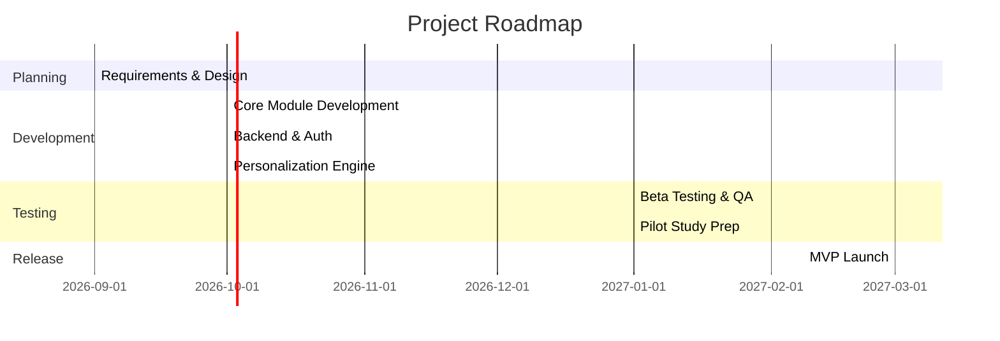

# Executive Summary  
Constant Therapy is a commercial app delivering **personalized, evidence-based cognitive, language and speech exercises** for users with neurological conditions (stroke, TBI, aphasia, dementia, etc.).  It offers an adaptive library of over **1 million exercises** across “90+ therapy areas”.  Key skill domains include *speaking/pronunciation, memory (auditory/visual/working), attention, reading, writing, language comprehension, math/problem-solving, visual processing,* among others.  Content formats span text, images and audio; exercise types include naming, matching, sequencing, fill-in-the-blank, repeating phrases, problem solving, and “drill”-style articulation tasks.  A patented **NeuroPerformance Engine (NPE)** uses AI to continuously adapt difficulty to each user’s performance.  Users receive instant feedback and performance reports, with progress tracked across domains.  Clinically, CT targets rehabilitation goals in *aphasia, dysarthria/apraxia (motor speech), memory and executive function*, supporting daily activities (e.g. reading, medication management).  Research (e.g. a 2021 RCT with post-stroke aphasia patients) shows CT users achieved significantly better language outcomes (e.g. ~6.4 point gain on the WAB-AQ) than controls.

We infer CT’s architecture is **cloud-based** with native mobile/web front-ends and REST/GraphQL APIs.  Likely components include: front-end apps (iOS/Android/Chromebook/Web) with offline caching; a back-end (perhaps Node.js or Python) serving exercise content and recording user progress; a database for users, exercises, and response logs; object storage for media (images, audio); and the NPE engine (possibly Python/TensorFlow or PyTorch models) to adapt content.  Security/HIPAA (encryption, BAA) is addressed at the enterprise level.  Offline support may be limited (FAQ implies constant connection), but a self-guided mode allows clinicians or users to adjust exercise schedules and levels.

For a **free, low-cost app**, we recommend open-source tools: React Native or Flutter for cross-platform UI; Node.js/Express or Django/Flask for back-end; PostgreSQL or MySQL for structured data; S3/GCS for media; and TensorFlow/PyTorch for ML.  For auth, open solutions like Keycloak (free) or Firebase/Auth0 (free tiers) can be used.  A simple analytics (Google Analytics or Matomo) and CI/CD pipeline (GitHub Actions, Docker, Kubernetes) round out the stack.  Advantages/costs and scalability considerations are detailed in the stack table below.

We outline a **data model** for users, exercises, and progress logs (with sample schema).  An implementation roadmap spans ~6–9 months from design through MVP launch (Mermaid Gantt timeline below).  Core MVP features include: basic exercise modules (memory, language), adaptive difficulty, user accounts, progress tracking, and clinician oversight tools.  Finally, we propose a **validation study design**: a randomized controlled trial comparing the new app to standard therapy (10–12 weeks, ~30–50 participants per arm), using outcomes like aphasia test scores (e.g. WAB) and cognitive batteries.  Ethics cover informed consent, data privacy, and minimizing harm. 

**References:** Official Constant Therapy documentation (website, app stores), peer-reviewed studies, and related clinical resources are cited throughout.  

## 1. Constant Therapy: Features and Modules  

Constant Therapy (CT) is designed as an at-home extension of clinician-led therapy.  It supports adults recovering from stroke/TBI or living with aphasia, dementia, Parkinson’s, etc. Users set goals (e.g. word-finding, memory, math) and CT automatically delivers *personalized, adaptive exercises*.  Key aspects:  

- **Domains & Skills:**  CT covers **speech, language and cognitive** domains.  The *skills* practiced include: *word finding/naming, articulation drills (speech sounds and multisyllabic sequences)*, *auditory comprehension*, *reading comprehension*, *writing/spelling*, *memory (auditory working memory, visual memory)*, *attention and executive function*, *problem-solving, logical reasoning, arithmetic/math*, *visual processing* and more.  For example, blog content highlights that CT contains *“adaptive drill-based modules progress automatically from single sounds to multisyllabic words and phrases”* for motor speech practice.  Another source notes CT exercises “improve language, memory, attention, and reasoning skills” in a tailored program.

- **Exercise Library:**  The app boasts **1M+ exercises** spanning *“90+ therapy areas”*.  The CT website lists tasks like *Copy Words, Spell What You Hear, Alphabetize Words, Quantitative Reasoning, Reading Comprehension, Visual Memory (N-back),* etc..  Each exercise typically has multiple difficulty levels (often 5–12 levels, adjusting e.g. complexity of stimuli).  Formats include *multiple-choice, free text entry, matching, sequence ordering, oral repetition (with audio cues), timed tasks*, etc.  Content (e.g. sentences, pictures) is functional (e.g. medication labels, menus) and can be customized to language (English dialects/Spanish).

- **Personalization & Adaptation:**  CT uses an AI-driven **NeuroPerformance Engine (NPE)** to adapt the therapy regimen.  The NPE analyzes each user’s accuracy and speed, compares to peers with similar profiles, and adjusts task difficulty and mix accordingly.  Users choose goals and CT’s *“ever-adjusting exercises based on [their] unique needs”*.  A “Self-Guided Mode” also lets users or clinicians select/unselect exercises and set difficulty/repetition manually.  Adaptation ensures users remain appropriately challenged (“so you stay appropriately challenged every time”).  

- **Progress Tracking:**  After each task, CT provides *instant feedback* and updates performance dashboards.  It tracks metrics such as accuracy, completion time, and scores across domains.  Users and clinicians can view *“easy-to-understand performance reports”* and progress summaries.  Compliance (frequency of use) and dose are monitored.  Clinical studies note that CT users get ~5x more practice than standard care.  

- **Target Conditions:**  The primary goals are rehabilitation of communication and cognition after neurological injury.  CT explicitly targets **aphasia**, **stroke/TBI recovery** (for language and cognitive deficits), **dementia/MCI**, **Parkinson’s** etc..  It also supports dysarthria/apraxia (motor speech) through specific speaking and pacing tasks. Functional goals (reading menus, medication management, communication with family) are emphasized.  The product carries disclaimers that it’s not a substitute for professional care, but is meant to *supplement* therapy (e.g. “practice daily home-exercises to supplement aphasia therapy”).

**Key Clinical Goals by Module:** Aphasia patients work on naming, comprehension, and reading/writing.  Motor-speech patients practice articulation drills and pacing.  Patients with memory/attention deficits get exercises (e.g. N-back, sequencing).  Math tasks rebuild numeracy.  Attention/executive tasks include visual search, pattern recall, and reasoning puzzles.  All exercises are “evidence-based” (CT cites 70+ studies).

## 2. Hypothesized System Architecture  

Based on CT’s description and typical practice, we infer a **multi-tier cloud architecture**.  The **front end** likely includes native mobile apps (iOS/Android) and a web/Chromebook interface (e.g. React or cross-platform framework).  The UI is designed for ease-of-use by cognitively-impaired users (large buttons, minimal text).  A **backend server** (e.g. Node.js, Django) provides APIs for authentication, content delivery, and progress logging.  A **database** stores user profiles, settings, exercise definitions, progress logs and scores.  Media assets (images, audio cues) are served from cloud storage (S3/GCS or CDN).  

A possible high-level flow:  

```mermaid
flowchart LR
  subgraph Client
    U[User Device] -->|calls API| API[Backend API Server]
    U -- offline? --> LocalDB[(Local Cache)]
  end
  subgraph Server
    API --> UserDB[(User & Account DB)]
    API --> ExDB[(Exercise Content DB)]
    API --> ProgDB[(Performance Logs DB)]
    API --> ML[(NPE / AI Engine)]
    API --> Auth[Auth Service (OAuth/SSO)]
    API --> Storage[(Media Storage)]
  end
  ML --> ExDB
  ML --> ProgDB
```

- **Front End:** Users access exercises via mobile apps or web.  The FAQ notes CT works on iOS, Android, Amazon Fire, Chromebooks, and recent Macs.  A shared login is used across devices (only one device active at a time).  Offline mode seems limited: the FAQ implies the app needs internet (“check internet connection” to open app).  We hypothesize that some content may be cached (e.g. current session tasks) but new tasks and sync require connectivity.

- **Backend & APIs:**  The server handles user authentication (email/password or clinician-assigned), session management, and business logic.  It likely exposes REST or GraphQL endpoints for: retrieving next exercises, submitting answers, fetching progress reports, and managing clinician instructions.  For enterprise (clinician/organization) use, SSO and MFA are supported.  The system must comply with HIPAA for PHI if used by covered entities: CT provides an Enterprise license with BAA and enhanced security (SSO, logging, audit trails).

- **Database Schema (Hypothetical):**  We expect tables such as *Users*, *Exercises*, *Domains*, *Assignments*, *ProgressLogs*, *Clinicians*, etc.  Users have demographics, condition, language preferences, etc.  Exercises have type, domain, stimuli references.  A join table *UserAssignments* tracks which exercises are in a user’s home program (with assigned difficulty).  A *ProgressLog* table records each completed task (user_id, exercise_id, timestamp, score, accuracy, response data).  **Media** (image/audio) references may be stored as URLs or file IDs.  

  A **sample schema** (illustrative) might include:
  - **User**(id, name, email, age, condition, language, last_active, etc.)
  - **Exercise**(id, domain, name, content_type, difficulty, description, level_count)
  - **Domain**(id, name)  
  - **UserAssignment**(user_id, exercise_id, assigned_date, repetition_goal, custom_difficulty)
  - **Progress**(id, user_id, exercise_id, attempt_time, correct_count, response_data, duration)
  - **Clinician**(id, name, organization, etc.) linking to User if applicable.

  For example, a class diagram:  
  ```mermaid
  classDiagram
    class User {
      +string id
      +string name
      +string email
      +string condition
      +string language
    }
    class Exercise {
      +string id
      +string domain
      +string name
      +int maxDifficulty
      +string description
    }
    class Progress {
      +string id
      +string user_id
      +string exercise_id
      +datetime timestamp
      +int score
      +bool correct
    }
    User "1" o-- "*" Progress : performs
    Exercise "1" o-- "*" Progress : includes
    User "1" o-- "*" Exercise : assigned
  ```
  Each *Progress* row logs a user’s attempt at an exercise, with performance metrics.  This model supports querying user improvement over time and exercise difficulty tuning.

- **Personalization/ML (NPE):**  The NeuroPerformance Engine is an AI component (likely a service or microservice) that uses machine learning to tailor therapy.  Research from CT authors mentions deep recurrent networks for *knowledge tracing*, suggesting they model user learning curves.  The NPE likely takes inputs of user ID, condition, and recent performance metrics, and outputs a recommendation of next exercises and difficulty adjustments.  It may rely on historical data (millions of exercise attempts) to compute statistics.  In practice, it could be implemented in Python (TensorFlow/PyTorch) and queried via API from the backend.  The CT team has patents on this AI engine.

- **Security & Privacy:**  The app deals with health and cognitive data, so encryption in transit (HTTPS/TLS) and at rest is needed.  The Play Store listing confirms data is encrypted in transit.  For HIPAA-compliant deployments, CT provides a Business Associate Agreement and enterprise security (SSO, MFA, audit logs).  On the user app (free version), CT collects “Personal info, Health and fitness” and shares “Health and fitness, Audio, App activity” with third parties.  Thus any clone must have a robust privacy policy and data handling safeguards.  (E.g. on-device encryption, minimal PII collection, GDPR/HIPAA compliance as applicable.)

- **Offline Support:**  The official CT app seems to require online use.  For low-income users, we might add offline caching of exercise content via a local database (SQLite) and sync when online.  Offline mode requires bundling enough tasks and logic locally.  This introduces complexity (need to queue progress updates, manage conflict).  Given no direct evidence of CT’s offline support, our app could implement a PWA or React Native offline strategy.

- **Content Management:**  CT updates exercises regularly.  We assume a CMS or admin portal is used by CT staff/clinicians to create new tasks (they mention “constant updates”).  An open-source solution could be a headless CMS (e.g. Strapi, Prismic) or a custom admin UI to add/edit exercises and upload media.

## 3. Legal, Regulatory & Privacy Considerations  

Building a therapy app requires attention to medical device regulation, IP, and user privacy:

- **Regulatory (FDA):**  Digital therapeutics can be considered Software as a Medical Device (SaMD).  CT recently earned FDA *Breakthrough Device* designation for a speech therapy app powered by their NPE.  This indicates FDA scrutiny on safety/efficacy is relevant.  If our app makes clinical claims (e.g. “improves speech”)*, it could be subject to FDA oversight.  A free, non-prescriptive app might try to classify as a general wellness or education tool to avoid regulation.  We should include disclaimers (as CT does) that the app is not medical advice.  

- **HIPAA & Data Privacy:**  If the app is used by healthcare providers or handles PHI, HIPAA applies.  For a free consumer app, HIPAA may not directly apply unless a covered entity is involved.  Nonetheless, we must protect user data.  Best practice is to host on HIPAA-compliant cloud services (AWS, Azure with BAA).  Ensure BAA with any third-party that handles data (e.g. cloud storage, auth providers).  Per the CT enterprise page, enterprise accounts have BAA, SSO, MFA.  For low-income user app, we should still treat data as sensitive: encrypt data at rest, use HTTPS, offer account deletion, minimal data sharing.  A clear **privacy policy** is mandatory for Play Store publication.  The developer (Learning Corp) notes users *can request data deletion*; our app should too.  If voice or audio is recorded, explicitly inform users and secure that data.

- **Intellectual Property:**  CT’s content (exercises, graphics, sound) is proprietary.  We cannot copy CT’s exact tasks or branding.  We should develop original or open-license content.  Likewise, names like “Constant Therapy” are trademarked, so avoid confusion.  However, rehabilitation tasks (e.g. spelling words, pattern recall) are generic; we can create analogous exercises.  For algorithmic ideas, AI methods are not IP-protected but CT’s *NPE* name/patents are.  We need to check existing patents if employing similar adaptive algorithms to avoid infringement.  

- **Free App for Low-Income Users:**  If offering it free, revenue isn’t an issue but sustainability is.  We must consider ongoing maintenance costs, perhaps seeking grant support.  For distribution, Google Play is straightforward (CT is on both stores).  Compliance with Google Play policies is needed: we must declare data usage accurately (e.g. health and audio data categories).  Because it’s health-related, we must avoid misleading claims and follow the “Restricted content – Medicine and health” policies.  A detailed privacy policy, accessible from the store listing, is required by Google if health data are collected.  

- **Accessibility & Ethics:**  The app must be accessible to users with impairments (large fonts, voice-over support).  Consent: if collecting any personal data (like age or condition), we need a simple consent form.  Ethical content: no offensive material; tasks should be culturally neutral.  If using ML personalization, ensure it does not inadvertently demotivate users (e.g. repeated failures).  Inclusion: language options (CT supports English/Spanish), consider adding more if budget allows.

## 4. Open-Source / Low-Cost Tech Stack Recommendations  

Below is a set of suggested technologies and frameworks to implement the app cost-effectively.  We emphasize open-source or free-tier solutions where possible.  

| Component            | Options (Open/Free)                                 | Pros/Cons & Cost                           |
|----------------------|-----------------------------------------------------|--------------------------------------------|
| **Frontend (Mobile/Web)** | React Native (JS) or Flutter (Dart); alternative: Progressive Web App (PWA) | *Pros:* Cross-platform code reuse, large community. *Cons:* Need native capabilities (audio recording, performance) – React Native bridges, Flutter performant. *Cost:* Free (MIT). |
| **Backend (Server)**  | Node.js/Express, Python/Flask or Django, or Java/Spring (open-source) | *Pros:* Well-supported frameworks, many libraries (auth, ML integration). *Cons:* Maintain servers. *Cost:* Free software; hosting ~$10–20/month on small cloud VM or free tiers. |
| **Database**         | PostgreSQL or MySQL (free), or MongoDB (OSS)       | *Pros:* Relational DBs fit structured data (users, exercises). *Cons:* Need hosting. *Cost:* Free DB engines; cloud DB instance ~$15/month (AWS RDS free tier/low-tier). |
| **Cloud Hosting**    | AWS/GCP/Azure (free credits/tiers), DigitalOcean, Heroku | *Pros:* Scalability, BAA available (AWS/Azure). *Cons:* Potential cost as scale grows. *Cost:* Basic server ~$5–10/mo; storage (images/audio) ~ $0.03/GB/month; bandwidth $0.08/GB on AWS. |
| **Storage (Media)**  | AWS S3 or GCP Storage (free tier available)         | *Pros:* Durable, scalable, HIPAA eligible. *Cons:* Egress charges if heavy. *Cost:* ~$0.023/GB-month, $0.09/GB out (AWS). |
| **Authentication**   | Keycloak (open-source IAM) or OAuth2 providers (Auth0 free tier, AWS Cognito) | *Pros:* Secure auth flows, SSO. *Cons:* Setup complexity. *Cost:* Keycloak free; Auth0 free up to 7000 users. AWS Cognito has free tier (50K/mo). |
| **Machine Learning** | TensorFlow, PyTorch (open-source) + SciKit-Learn for smaller models | *Pros:* Powerful, open libraries for neural nets (RNN for knowledge tracing). *Cons:* Requires ML expertise. *Cost:* Free libs; training on cloud GPU ~$0.50–3/hr if needed.|
| **Offline Support**  | SQLite or Realm (mobile DB), Service Workers for PWA | *Pros:* On-device caching of exercises/progress. *Cons:* Complexity syncing with server. *Cost:* Free libraries; dev time overhead. |
| **Analytics**        | Google Analytics, Matomo (open-source)            | *Pros:* Usage tracking, free plans. *Cons:* Privacy concerns (GA); Matomo self-hosting overhead. *Cost:* GA free; Matomo host ~$5–10/mo or self-host. |
| **Push/Notifications** | Firebase Cloud Messaging (free), or OneSignal | *Pros:* Reminders for exercises. *Cons:* FCM free but BAA needed for PHI. *Cost:* Free (with BAA if HIPAA). |
| **CI/CD / DevOps**   | GitHub Actions (free for open source), Docker, Kubernetes (Minikube or managed EKS/GKE) | *Pros:* Automated testing/deploy. *Cons:* Ops knowledge. *Cost:* GitHub free; Kubernetes complexity; can start with simpler Docker+VM. |
| **Content Mgmt**     | Strapi or Forest Admin (open-source versions)      | *Pros:* Manage exercises without coding. *Cons:* Extra component. *Cost:* Strapi free, hosting needed. |

A possible deployment: **AWS** (BAA available) using EC2 for server, RDS (Postgres) for DB, S3 for storage, Cognito for auth.  Combined with React Native mobile apps.  Estimated monthly cost (low usage): ~$20–30 (small instance + minimal storage/bandwidth).  As users grow, costs scale (more compute and storage).  

**Scalability:**  This stack can scale horizontally (stateless Node servers, load-balanced; DB read replicas).  Using cloud services simplifies scaling.  Containerization (Docker, Kubernetes) facilitates deployment automation and scaling.  

**Alternatives:**  For ultra-low cost, a static PWA hosting on free tiers (e.g. GitHub Pages) plus Firebase backend (free tier 10GB DB, 1M writes/mo) might work initially.  However, HIPAA compliance and complex logic (AI) likely require a traditional backend.  

## 5. Data Model & Sample Schema  

A minimal data model includes tables for **Users, Exercises, Assignments,** and **Progress Logs**.  Below is a simplified schema layout:

| Table        | Columns (Type)                     | Description                                                |
|--------------|------------------------------------|------------------------------------------------------------|
| **User**     | user_id (PK), name, email, age, language, condition, clinician_id, created_at | User profile, including therapy goals and preferences.  |
| **Clinician**| clinician_id (PK), name, email, org | (Optional) Therapist accounts linked to users.             |
| **Exercise** | exercise_id (PK), name, domain, type, max_difficulty, content_uri, description | Definition of each exercise/task and metadata. |
| **Assignment** | assign_id (PK), user_id (FK), exercise_id (FK), assigned_date, custom_difficulty, repetitions_goal | Exercises scheduled for a user (HEP).   |
| **Progress** | progress_id (PK), user_id (FK), exercise_id (FK), timestamp, score, correct_count, response_data | Logs of each attempt (results). |
| **Domain**   | domain_id, name                   | Lookup for skill domains (Language, Memory, etc).          |

A **Mermaid ER-diagram** outline is:  


This model supports features such as: assigning exercises to a user’s program, recording each session’s results, and retrieving histories to compute progress metrics or feed to the NPE.

## 6. Implementation Roadmap and Timeline  

An agile development plan might proceed in phases:

1. **Requirements & Design (Month 1):** Gather detailed requirements (from clinicians, patients). Finalize tech stack. Draft UI designs and data models.
2. **Core Development (Months 2–4):** Build MVP with key exercises (e.g. 2–3 modules like memory and naming), user registration/login, basic progress tracking. Backend and simple UI.
3. **Adaptive Engine (Months 4–5):** Implement personalization logic (even simple rules or early ML). Integrate difficulty adjustment.
4. **Testing & Iteration (Month 6):** Internal testing, iterate UX. Add remaining exercise modules (attention, comprehension, etc).
5. **Pilot Study Prep (Months 7–8):** Prepare for validation study (ethics approval, recruitment). Refine app for target population.
6. **MVP Launch (Month 9):** Release on Play Store. Collect user feedback and usage data.
7. **Post-Launch (Month 10+):** Analyze pilot results, add features (clinician portal, more exercises), optimize AI, and iterate.



A Mermaid Gantt chart alternative:  


**Priority MVP Features:**  (a) user signup/authentication; (b) a set of representative exercises in each major domain; (c) simple UI for exercise flow; (d) progress logging and summary reports; (e) basic adaptive logic (e.g. increase difficulty after X correct); (f) clinician mode to create user or adjust plans; (g) data privacy (login, TLS).  Features like offline mode, full AI adaptation, extensive reporting and integration (EMR export) come later.

## 7. Research & Clinical Validation Plan  

To academically validate the app’s efficacy, we propose a **clinical study** akin to prior work:

- **Study Design:** A randomized controlled trial (RCT) with two arms: **Intervention** (using our app) vs **Control** (standard care or non-adaptive therapy workbook). Participants: adults with chronic aphasia after stroke (e.g. >6 months post-stroke), or another defined group (e.g. mild cognitive impairment). Randomize ~30–50 per group to ensure adequate power (Braley et al. used n=16 each and found effects, but larger n improves reliability). Use block randomization to balance covariates (age, severity).

- **Intervention:** 8–12 weeks of daily or near-daily practice on the app, 30–60 minutes/day. Clinicians prescribe tailored programs in the app. Control group either receives no intervention beyond usual care or a non-digital equivalent (e.g. paper exercises or a locked set of app tasks without adaptation).

- **Outcome Measures:** Primary – validated language/cognitive scales. For aphasia, use the **Western Aphasia Battery – Aphasia Quotient (WAB-AQ)** or Boston Naming Test. For cognition/memory, the **Brief Test of Adult Cognition (BTACT)** or similar. Quality of Life (e.g. **SAQOL-39** for aphasia). Secondary – app usage metrics (dose), adherence, and subjective satisfaction. Assess at baseline, mid-point, and post-intervention.  

- **Ethics & Data:** Obtain IRB approval, with consent forms explaining the study and data use. Ensure minimal risk: the app should not cause harm (it’s essentially exercise practice). Monitor for fatigue or frustration. Data privacy measures: de-identify data for analysis, secure storage. If recording any voice samples, obtain explicit consent.

- **Sample Size:** For moderate effect sizes (e.g. d≈0.5), around 50 subjects total gives ~80% power (two-tailed α=0.05).  Pilot data (like Braley et al.) can guide variance estimates. Dropout rate ~10–20% in rehab studies, so oversample accordingly.

- **Study Flow:** Recruit via clinics or registries. Screen for inclusion (verified aphasia). Pre-test assessments, randomize, then intervention period. Weekly compliance checks. Post-test within 1 week of finishing. Optionally, a follow-up at 3 months to assess retention.

- **Analysis:** Compare change in primary outcome (post-pre) between groups using ANCOVA controlling baseline. Evaluate clinically meaningful improvement thresholds. Also analyze dose-response: does more app usage correlate with better outcomes? Collect qualitative feedback on usability.

The study outline for a publication:
1. **Introduction:** Rationale and background (CT literature, need for accessible rehab).
2. **Methods:** App description (features, modules), participants, randomization, procedures.
3. **Results:** Participant flow, adherence, outcome data.
4. **Discussion:** Interpretation (similar to CT papers), limitations.
5. **Conclusion:** Effectiveness and future work.

Citing related work will strengthen the paper: e.g. CT RCTs, feasibility studies for digital therapy (e.g. Marin et al. 2022).

## 8. Risks, Limitations & Ethical Considerations  

Finally, potential challenges and ethical issues:

- **Accessibility & Digital Divide:** Users with cognitive impairments may struggle with complex apps. The design must be simple. Low-income users may lack smartphones or internet access. Offline capability and possibly device loan programs should be considered.  

- **Overuse / Fatigue:** Intensive training can cause fatigue or frustration. The app should monitor user engagement (as CT does) and encourage breaks. Logging too much personal data may reduce trust.  

- **Data Privacy:** Collecting health data (language ability, scores) risks privacy. Safeguards (encryption, anonymization) are essential. Inform users clearly about data use. Our target (low-income) may also include vulnerable groups; compliance with child protection (if minors, unlikely here) and elder privacy laws is needed.  

- **AI Bias/Misadaptation:** The adaptive engine might not be transparent to users. If it misjudges a user’s ability (either too easy or too hard), it could demotivate them. We should allow manual override (like CT’s self-guided mode) and continuous algorithm evaluation.  

- **Clinical Misuse:** There is a risk users or clinicians may over-rely on the app instead of professional guidance. Marketing and in-app text must clarify it is a supplement, not a standalone therapy.  

- **Content Validity:** Exercises must be clinically sound. We must involve SLPs and neuropsychologists in content creation. If copying tasks from literature or existing tests, ensure licensing or use public-domain materials.  

- **Intellectual Property and Licensing:** Avoid patent infringement on CT’s methods. Consider open-source licenses for the app code (e.g. MIT or Apache) to encourage adoption.  

- **Regulatory Compliance:** If later pursuing medical claims or clinical deployment, prepare for FDA/EMA review. Initially position the app as a wellness/education tool to minimize regulatory burden.  

- **Liability:** Include disclaimers (as CT does) that improvement isn’t guaranteed, and users should follow healthcare advice.  

**Summary:** While a digital therapy app holds great promise for rehabilitation, careful attention to ethics, privacy, and realistic expectations is necessary.  By building in safeguards, involving clinicians in development, and conducting rigorous evaluation, we can mitigate these risks.  

---

**Table: Recommended Tech Stack (Open-Source options)**  

| Layer           | Technology          | Role                                  | Pros/Cons                     |
|-----------------|---------------------|---------------------------------------|-------------------------------|
| Mobile/Web UI   | React Native / Flutter / PWA (React) | Cross-platform app front-end    | + Single codebase, free; – Performance tuning |
| Server/API      | Node.js (Express) or Python (Django/Flask) | Business logic, APIs             | + Mature frameworks; – Requires hosting |
| Database        | PostgreSQL / MySQL  | Store users, exercises, logs         | + ACID, free; – Server needed  |
| Media Storage   | AWS S3 / Google Cloud Storage | Host images/audio               | + Scalable, encrypted; – Cost beyond free tier |
| ML Framework    | TensorFlow or PyTorch | Adaptive personalization engine     | + Powerful, community; – Need data/compute |
| Authentication  | Keycloak (OSS) or AWS Cognito | OAuth2 user auth, SSO            | + Secure, free tier; – Setup complexity |
| Hosting         | AWS/GCP/Azure (VMs, Containers) | Backend and DB hosting           | + Scalable, HIPAA-ready; – Operational cost |
| Analytics       | Google Analytics or Matomo | Track usage & engagement        | + Free/basic plans; – Privacy (GA) |
| Notifications   | Firebase Cloud Messaging | Reminders/notifications         | + Free (with BAA); – Dependent on network |
| DevOps          | Docker, Kubernetes, GitHub Actions | CI/CD, containerization       | + Reproducible builds; – Learning curve |
| Content CMS     | Strapi or Netlify CMS | Manage exercises/updates         | + No-code content updates; – Additional component |

Each choice balances cost, scalability, and ease. For instance, AWS offers a free tier and BAA (suitable for HIPAA), but ongoing costs can rise. Open-source solutions like Strapi (headless CMS) or Keycloak give control without vendor lock-in.  

---

### Key References  

- Constant Therapy official site and documentation  
- Constant Therapy app store descriptions  
- Braley et al. (2021), *Front. Neurol.* – RCT of Constant Therapy in aphasia  
- CT health blog (motor speech disorders)  
- Stroke Foundation aphasia blog (summary)  

