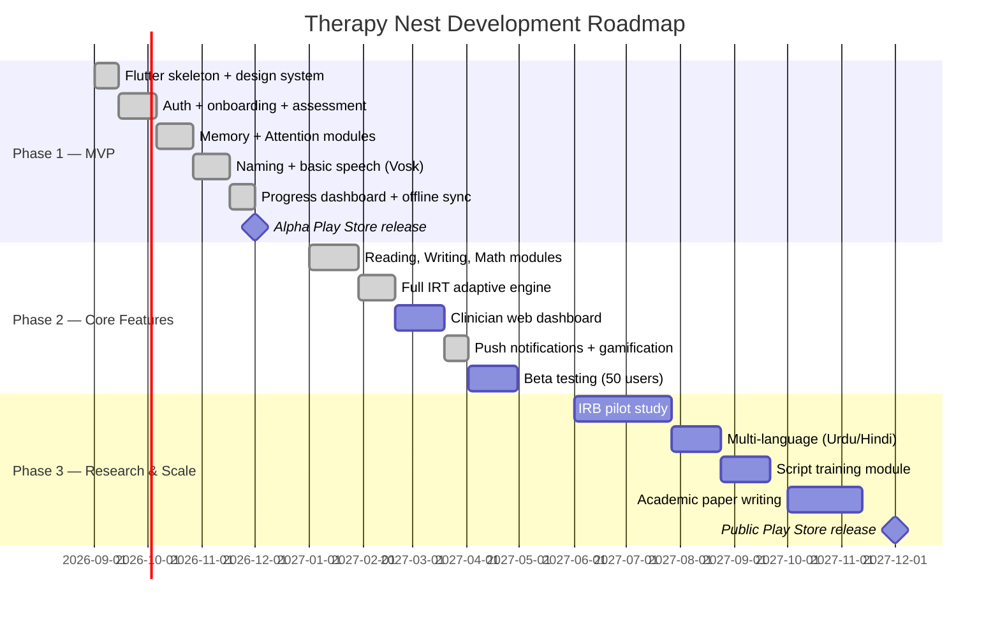

# 🧠 Therapy Nest — Best Free Development Approach
### Synthesized from ChatGPT · Claude · Gemini · lmArena Research

---

> [!IMPORTANT]
> This document synthesizes all four AI model research files, the `DESIGN-claude.md` design system, and the Flutter Provider Architecture skill into a **single, cohesive, free development strategy**. Review and confirm this plan before I generate the full module-by-module App Prompt.

---

## 🎯 What Therapy Nest Is

A **free, open-source, offline-capable** cognitive & speech therapy mobile app for stroke, aphasia, TBI, and dementia patients — inspired by Constant Therapy (which costs $30/month), designed for underserved populations globally, built entirely with open-source tools.

**Your competitive advantage:**
- 100% free, forever
- Full offline mode
- Adaptive AI engine (IRT-based, no subscription)
- Open-source (MIT license)
- Clinically grounded, academically publishable

---

## ✅ Recommended Tech Stack (100% Free)

| Layer | Tool | Why |
|-------|------|-----|
| **Mobile Framework** | **Flutter (Dart)** | Single codebase for Android + iOS, best offline support, low RAM footprint for budget phones |
| **State Management** | **Provider + ChangeNotifier** | Per the Flutter skill file — scalable, testable, no mixing |
| **Navigation** | **go_router** | Per the Flutter skill file |
| **Local Database** | **Drift (SQLite)** | Offline-first, typed queries, background sync support |
| **Backend** | **Python FastAPI** | API + adaptive engine in one language; free to self-host |
| **Remote DB** | **PostgreSQL via Supabase** | Free tier (500MB), real-time, row-level security, REST auto-generated |
| **Auth** | **Supabase Auth** | Free, JWT-based, Google sign-in, no vendor lock-in |
| **File Storage** | **Supabase Storage** | Free tier (1GB), for images and audio assets |
| **On-device ASR (Speech)** | **Vosk** (primary) + **Whisper.cpp** fallback | Fully offline, multilingual, no API cost |
| **On-device TTS** | **Piper TTS / flutter_tts** | Free, offline voice prompts for low-literacy users |
| **Adaptive Engine** | **Elo-style IRT (Python)** | Logistic regression, scikit-learn — no heavy ML infra needed at MVP |
| **Notifications** | **Firebase Cloud Messaging (FCM)** | Free tier, reminders for daily therapy |
| **CI/CD** | **GitHub Actions** | Free for open-source |
| **Hosting (Backend)** | **Render / Koyeb** | Free tier to start (runs 24/7 or kept awake via cron pinger) |
| **Analytics** | **PostHog (self-hosted)** | Free, privacy-friendly, no per-user billing |

> [!NOTE]
> All tools above have **zero licensing cost**. The only recurring cost is server hosting (~$0/month on free tiers).

---

## 🏗️ App Architecture

Following the **Flutter Provider Architecture** from your skill files:

```
┌──────────────────────────────────────────────────────────┐
│                   Flutter Mobile App                       │
│  Provider + go_router + Drift (SQLite) + Vosk/Piper       │
│  Patient UI │ On-device ASR │ Offline Exercise Cache       │
└─────────────────────────┬────────────────────────────────┘
                          │ HTTPS (opportunistic sync)
┌─────────────────────────▼────────────────────────────────┐
│              FastAPI Backend (Python)                      │
│  Auth │ Session Logging │ Content API │ IRT Engine         │
│  Speech Scoring (faster-whisper) │ Progress Prediction     │
└─────────┬──────────────────────────────┬─────────────────┘
          │                              │
┌─────────▼──────────┐      ┌────────────▼──────────────────┐
│  PostgreSQL (Supabase)│   │  Supabase Storage              │
│  Users, Exercises,   │   │  Images, Audio Stimuli          │
│  Sessions, Attempts, │   │  (lazy-loaded by domain)        │
│  Ability Estimates   │   └───────────────────────────────┘
└────────────────────┘
          │
┌─────────▼───────────────────────────────────────────────┐
│  Clinician Web Dashboard (Phase 2 — optional React web)  │
│  Patient roster │ Progress charts │ Exercise assignment   │
└─────────────────────────────────────────────────────────┘
```

**Monolith-first rule** (from Claude's blueprint): Start as a single FastAPI service + one PostgreSQL database. No microservices until you have real traffic.

---

## 📂 Flutter Folder Structure

Following `skill-2.md` exactly:

```
lib/
  main.dart
  app/
    app.dart
    config/           # env.dart, app_config.dart
    routes/           # app_routes.dart, app_router.dart, route_guards.dart
    di/               # app_providers.dart (composition root)
  core/
    constants/        # app_colors.dart, app_text_styles.dart, app_dimens.dart,
                      # app_assets.dart, app_strings.dart
    theme/            # theme.dart, typography.dart
    utils/            # logger, validators, formatters, extensions
    widgets/          # app_button, app_text_field, app_loader, etc.
    errors/           # failure.dart, api_error_mapper.dart
  data/
    api/              # api_client.dart, api_endpoints.dart, api_response.dart
    models/           # user_model, exercise_model, session_model, etc.
    repositories/     # auth_repo, exercise_repo, session_repo, progress_repo
    storage/          # local_store.dart, token_store.dart
    local_db/         # Drift database + DAOs for offline storage
  modules/
    auth/             # login, register, onboarding pages + viewmodels
    assessment/       # baseline diagnostic onboarding
    home/             # dashboard, domain overview
    exercises/        # exercise engine (the core module)
    progress/         # charts, history, achievements
    settings/         # profile, language, accessibility
    clinician/        # (Phase 2) therapist linking
```

---

## 🎨 Design System (Adapted from DESIGN-claude.md)

The design system from `DESIGN-claude.md` is Claude.ai's marketing site design — we adapt its **warmth and editorial feel** for a therapy context:

### Color Palette for Therapy Nest

| Token | Value | Use |
|-------|-------|-----|
| `primary` | `#4A90D9` (calm blue) | CTAs, active states — blue evokes calm/trust (better than coral for medical) |
| `primary-active` | `#2B6CB0` | Button press |
| `canvas` | `#F7F9FC` | Page background — slightly cool-white, clean |
| `surface-card` | `#EEF2F7` | Exercise cards, domain cards |
| `surface-dark` | `#1A2744` | Progress charts, dark mode elements |
| `accent-teal` | `#38B2AC` | Correct answer feedback, success |
| `accent-amber` | `#ECC94B` | Streak badges, achievements |
| `ink` | `#1A1A2E` | All headlines |
| `body` | `#4A4A5A` | Body text |
| `error` | `#E53E3E` | Wrong answer feedback |
| `success` | `#38A169` | Correct answer feedback |

> [!NOTE]
> We **adapt** DESIGN-claude.md's warm editorial language (serif headlines, generous spacing, card elevation system) but shift the palette from coral/cream → calm-blue/cool-white — more appropriate for a healthcare app and users with visual impairments.

### Typography (Flutter equivalents)
- **Display/Headlines**: `Nunito` (Google Font, free) — rounded, friendly, accessible
- **Body**: `Inter` — humanist sans, excellent screen legibility
- **Monospace (code/data)**: `JetBrains Mono`

### Accessibility (WCAG 2.1 AA — mandatory for therapy app)
- Minimum touch target: **64dp × 64dp** (larger than standard — for motor impairments)
- Contrast ratio: **4.5:1 minimum** for all text
- All text resizable up to 200% without breaking layout
- TTS narration on all instructions (Piper TTS offline)
- High-contrast mode support

---

## 🧩 Core Modules (MVP → Phase 3)

### Phase 1 — MVP (Months 1–3)

| Module | Description | Domains |
|--------|-------------|---------|
| **Onboarding & Assessment** | Condition selection, baseline mini-test per domain, goal setting | All |
| **Memory Exercises** | Pattern recall, auditory memory, visual memory | Memory |
| **Attention Exercises** | Symbol matching, timed selection, distractor tasks | Attention |
| **Language — Naming** | Picture naming, word finding, semantic cueing hierarchy | Language |
| **Progress Dashboard** | Accuracy trends, domain radar chart, daily streak | All |
| **Offline Mode** | Local SQLite cache, background sync queue | Infrastructure |
| **Speech Tasks (basic)** | Vosk-powered word repetition, phoneme scoring | Speech |

### Phase 2 — Core Features (Months 4–6)

| Module | Description |
|--------|-------------|
| **Reading & Writing** | Word matching, sentence completion, spelling from dictation |
| **Math & Numeracy** | Clock reading, currency calculation, number sequencing |
| **Auditory Comprehension** | Follow spoken instructions, voicemail comprehension |
| **Adaptive IRT Engine** | Full Elo → 2PL IRT ability estimation per domain |
| **Clinician Dashboard** | Web app (React) — assign exercises, monitor progress |
| **Push Reminders** | FCM daily practice notifications |
| **Second Language** | Urdu/Hindi support (Vosk multilingual models) |

### Phase 3 — Research & Scale (Months 7–12)

| Module | Description |
|--------|-------------|
| **Script Training** | Conversational scripts, avatar-guided practice |
| **Caregiver View** | Family progress monitoring |
| **Therapy Calculator** | Logistic regression on your own session data (CT's own published method) |
| **Gamification** | Badges, streaks, milestone celebrations |
| **IRB Pilot Study** | Data collection for academic paper |
| **Play Store Release** | Public release with Organization account |

---

## 🤖 Adaptive AI Engine (Free, No Cloud ML)

**Start simple, grow as data accumulates:**

### Phase 1: Elo-Style Rating (MVP)
```
θ_new = θ_old + K × (outcome − expected)
expected = 1 / (1 + 10^((b − θ_old) / 400))
```
- `θ` = patient ability per domain
- `b` = item difficulty (pre-seeded from literature)
- No training data required — works from day 1
- Target 70–80% success rate (the "flow channel")

### Phase 2: 2-Parameter IRT (scikit-learn / py-irt)
- Full IRT calibration once you have ~1,000 sessions
- Dynamic item selection (CAT — Computerized Adaptive Testing)
- Per-domain ability tracking with standard error

### Phase 3: Therapy Calculator (CT's published method)
- Logistic regression on your real session data
- Predict landmark transitions from: age, etiology, baseline, sessions/week
- Directly replicates CT's medRxiv-published methodology

---

## 🗄️ Database Schema (PostgreSQL via Supabase)

Synthesized from all four research files + Claude's detailed schema:

```sql
-- Users & Roles
users (id UUID PK, role, email, phone, locale, created_at)
patient_profiles (user_id PK→users, date_of_birth, etiology, diagnosis_detail,
                  onset_date, dominant_language, primary_clinician_id,
                  consent_research, consent_data_sharing)
organizations (id UUID PK, name, org_type, baa_signed)

-- Clinical Content
domains (id SERIAL PK, code, name, description)
exercise_types (id SERIAL PK, code, name, input_modality, response_modality)
exercise_type_domains (exercise_type_id, domain_id, weight)  -- many-to-many
exercise_items (id UUID PK, exercise_type_id, difficulty NUMERIC,
                locale, stimulus JSONB, accepted_answers JSONB,
                media_url, is_active)

-- Activity & Adaptive State
sessions (id UUID PK, patient_id, started_at, ended_at, device_info JSONB)
attempts (id UUID PK, session_id, exercise_item_id, response JSONB,
          is_correct, response_time_ms, hint_count,
          theta_before, theta_after, created_at)
ability_estimates (patient_id, domain_id → PRIMARY KEY,
                   theta NUMERIC, standard_error, updated_at)

-- Milestones & Care Plans
functional_landmarks (id SERIAL PK, domain_id, landmark_order, description)
patient_landmark_progress (patient_id, landmark_id, achieved_at, predicted_probability)
care_plans (id UUID PK, patient_id, clinician_id, target_domains INT[],
            sessions_per_week, created_at)

-- Compliance & Audit
audit_logs (id BIGSERIAL PK, actor_user_id, action, target_table, target_id, created_at)
```

---

## 🔊 Speech Recognition Pipeline

```
Mic Input → Silero VAD (noise gate, <2MB on-device)
          → Vosk (offline ASR, 20+ languages, ~50MB model)
          → Fuzzy match vs. accepted_answers JSONB
          → Phoneme similarity score (jellyfish/rapidfuzz library)
          → IRT outcome (correct / partial / incorrect)
```

**For spoken exercises:**
- Exact match → full credit
- Phoneme similarity > 85% → partial credit
- Response latency captured as secondary metric
- No audio ever sent to cloud (privacy by architecture)

---

## 📋 Play Store Deployment Checklist

> [!WARNING]
> Since Jan 2026, Google requires an **Organization developer account** for Health/Medical category apps. Individual accounts are no longer accepted.

- [ ] Register Organization Play Console account
- [ ] Complete Health Apps Declaration
- [ ] Complete Data Safety form (audio, usage analytics)
- [ ] Host Privacy Policy at public URL
- [ ] In-app disclaimer: "Practice companion — not a replacement for clinical therapy"
- [ ] Target Android API 34+
- [ ] Test on 2GB-RAM budget Android devices
- [ ] COPPA compliance (18+ only or parental consent)

---

## 📐 Development Roadmap



---

## 🎓 Academic Paper Opportunity

**Suggested Title:**
> *"Therapy Nest: An Open-Source, IRT-Adaptive Mobile Platform for Cognitive and Speech Rehabilitation in Resource-Constrained Settings — Design, Architecture, and Pilot Evaluation"*

**Target Journals:**
- Journal of Medical Internet Research (JMIR) — high impact
- Frontiers in Digital Health — open access
- PLOS ONE — broad reach

**Novel Contributions:**
1. Full offline edge-computing DTx platform for low-end Android devices
2. IRT + Elo hybrid adaptive engine without cloud ML dependency
3. Free alternative to commercial therapy apps for global underserved populations
4. Pathological speech recognition pipeline using Vosk on-device

---

## ⚖️ Legal & Regulatory Position

| Factor | Strategy |
|--------|----------|
| **FDA positioning** | "Self-managed practice companion" — not a diagnostic/treatment claim (same framing Constant Therapy uses for its consumer app) |
| **HIPAA** | Build to standard: TLS 1.2+, AES-256 at rest, RBAC, audit logs. Supabase provides BAA-eligible infrastructure. |
| **Pakistan/South Asia** | DRAP compliance: no diagnostic claims, health data treated as sensitive PII, offline-first means voice data never leaves device |
| **Content IP** | All exercise types are generic clinical tasks (not CT's proprietary stimuli). Create original content with SLP advisor. |

---

## 🔑 Key Decisions to Confirm

Before I generate the full module-by-module App Prompt, please confirm:

1. **Primary target language** — English only for MVP, or include Urdu/Roman Urdu from the start?
2. **Target audience** — Adults (stroke/aphasia/TBI patients) only, or also include children/elderly?
3. **Clinician portal** — Include in Phase 1 MVP, or defer to Phase 2?
4. **Speech tasks in MVP** — Yes (Vosk) or defer speech recognition to Phase 2?
5. **Design language** — Adapt the warm editorial style from `DESIGN-claude.md` (cream canvas, warm blue, Inter font) as described above, or do you have a different visual direction in mind?
6. **Backend hosting** — Start on Supabase free tier (recommended), or prefer self-hosted from day 1?

---

## 📌 Summary: What Makes This Approach Best

| Factor | Why This Wins |
|--------|---------------|
| **Flutter** | Single codebase, offline-first, excellent on low-RAM budget phones |
| **Supabase** | Free tier covers MVP; PostgreSQL with auto-REST; no vendor lock-in |
| **Vosk on-device ASR** | Zero API cost, works offline, multilingual |
| **Elo → IRT progression** | Adaptive without needing millions of data points upfront |
| **Provider + go_router** | Matches your existing Flutter skill file exactly |
| **Monolith-first backend** | Minimum infra cost for a free app |
| **Offline-first (Drift)** | Serves low-connectivity users — the core underserved market |
| **DESIGN-claude.md adapted** | Premium, editorial UI feel that communicates clinical seriousness |
