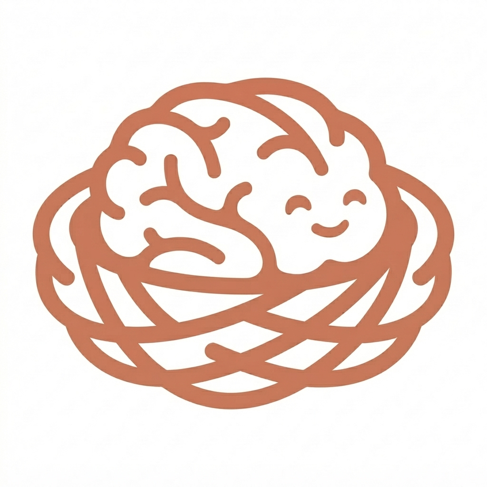

<div align="center">



# Therapy Nest — Mobile Application

**Accessible, Evidence-Based Cognitive & Speech Rehabilitation for Android & iOS**

[](https://flutter.dev)
[](https://dart.dev)
[](https://drift.simonbinder.eu)
[](https://alphacephei.com/vosk/)
[](https://www.w3.org/WAI/standards-guidelines/wcag/)

[🌐 Web Showcase](https://therapy-nest-web.vercel.app) · [📱 Direct APK Download](https://therapy-nest-web.vercel.app#download) · [📄 Clinical Whitepaper](https://therapy-nest-web.vercel.app/research.html)

</div>

---

## 📱 About the App

**Therapy Nest** is a free, permanently open-source mobile application engineered for stroke survivors, individuals recovering from traumatic brain injury (TBI), people living with aphasia, and individuals experiencing early-stage dementia.

Unlike commercial alternatives that enforce expensive subscription paywalls and rely on continuous cloud connectivity, Therapy Nest runs **100% offline** on consumer-grade smartphones (supporting Android API 23+ with as little as 2 GB RAM).

---

## 🌟 Key Technical & Clinical Highlights

### 1. 🔒 On-Device Speech Recognition (Vosk Kaldi Engine)
- Utilizes an embedded **Vosk acoustic recognition model** (`vosk_flutter`) running entirely within native device memory.
- Evaluates verbal pronunciation, phonemic accuracy, and apraxia exercises with **sub-200ms latency**.
- **100% Private & HIPAA-compliant**: Zero raw voice recordings or patient audio samples are ever transmitted across the network.

### 2. 🎯 Psychometric 2-Parameter Logistic (2PL) Item Response Theory
- Implements clinical latent trait theory to maintain patients inside the **Flow Channel (70%–80% target success rate)**:
  $$P(\theta) = \frac{1}{1 + e^{-a(\theta - b)}}$$
- Dynamically matches task difficulty ($b$) to individual cognitive ability ($\theta$) across 7 functional rehabilitation domains.
- Employs an online Elo calibration mechanism to adjust difficulty after each completed exercise without requiring cloud round trips.

### 3. 📴 Offline-First Reactive Storage (Drift SQLite)
- Authoritative on-device local database powered by **Drift** (formerly Moor).
- Reactive SQL streams automatically refresh user dashboards, streak tracking, and recovery charts in real time.
- Idempotent bidirectional synchronization queues safely upload anonymized progress to Supabase when network connectivity is available.

### 4. ♿ WCAG 2.1 AAA Accessibility Architecture
- Large, tremor-tolerant touch targets (minimum $48\times 48\text{ dp}$, recommended $56\text{ dp}+$).
- High-contrast color palette fully validated for standard and Dark Mode legibility (ratios exceeding 7:1 for normal text).
- Multimodal feedback combining Text-to-Speech (TTS), visual cues, and tactile haptic vibration patterns.
- Screen-reader first semantics with descriptive labels across all interactive elements.

---

## 🏛️ Project Directory Structure

```
therapy_nest/
├── assets/
│   ├── animations/               # Lottie celebration & motivational animations
│   ├── icons/                    # Scalable vector graphics (SVG) & UI glyphs
│   ├── images/                   # High-res branding (AppLogo.png, AppBar.png)
│   └── models/                   # Embedded Vosk offline speech recognition models
│
├── lib/
│   ├── app/                      # Application Bootstrap & Configuration
│   │   ├── config/               # Environment constants (Env.supabaseUrl, apiBaseUrl)
│   │   ├── routes/               # GoRouter paths, nested ShellRoutes & route guards
│   │   └── theme/                # Material 3 design tokens (Light & Dark theme palettes)
│   │
│   ├── core/                     # Reusable Core Services & Utilities
│   │   ├── constants/            # Colors, dimensions, typography, and string constants
│   │   ├── services/             # Vosk ASR, Audio, Haptics, and Flutter TTS controllers
│   │   ├── utils/                # Date formatters, validators, and logger helpers
│   │   └── widgets/              # Accessible buttons, cards, progress bars & dialogs
│   │
│   ├── data/                     # Data Layer & Repositories
│   │   ├── database/             # Drift SQLite database schema, DAOs & tables
│   │   ├── models/               # Domain data models & JSON serializers
│   │   └── repositories/         # Assessment, Therapy, Streak, and Sync repositories
│   │
│   ├── modules/                  # Feature Modules (Domain + Presentation)
│   │   ├── auth/                 # Login, Registration, Password Reset & Session Guards
│   │   ├── onboarding/           # 5-step personalized patient onboarding flow
│   │   ├── assessment/           # 10-minute diagnostic baseline evaluation
│   │   ├── home/                 # Daily practice hub, streak counter & domain cards
│   │   ├── therapy/              # Interactive exercise runners across all 7 domains
│   │   ├── progress/             # Recovery timeline, domain radar charts & metrics
│   │   └── settings/             # Accessibility controls, contrast toggle & profile
│   │
│   └── main.dart                 # App entry point, Supabase init & dependency injection
│
├── test/                         # Unit, Mock & Widget Test Suites
└── pubspec.yaml                  # Flutter package dependencies & asset declarations
```

---

## 🚀 Getting Started

### Prerequisites
* **Flutter SDK**: `3.29.x` or later ([Install Flutter](https://docs.flutter.dev/get-started/install))
* **Dart SDK**: `3.7.x` or later
* **Android SDK**: API level 23 (Android 6.0 Marshmallow) or newer
* **Java Development Kit**: JDK 17+

### 1. Install Dependencies
Navigate to the `therapy_nest` directory and fetch the packages:
```bash
cd therapy_nest
flutter pub get
```

### 2. Code Generation (Drift Database)
Generate the strongly typed Drift database classes:
```bash
dart run build_runner build --delete-conflicting-outputs
```

### 3. Configure Google Services
Copy the template configuration into place:
```bash
cp android/app/google-services.json.example android/app/google-services.json
```
*(Fill in your Firebase project credentials if using Google Sign-In or Cloud Messaging).*

### 4. Run the Application
Connect an Android device or launch an emulator, then execute:
```bash
# Debug Mode:
flutter run

# Profile Mode (for frame rate & memory analysis):
flutter run --profile
```

### 5. Build Production Release APK
```bash
flutter build apk --release --no-tree-shake-icons
```
The output binary will be generated at:
`build/app/outputs/flutter-apk/app-release.apk`

---

## 🧪 Testing & Code Quality

Run the static analyzer to verify zero lint errors:
```bash
flutter analyze
```

Execute all automated unit and repository test suites:
```bash
flutter test
```

---

## 📬 Contact & Support

- **Lead Engineer & Maintainer**: Abdur Rehman ([@CodeWith-AR](https://github.com/CodeWith-AR))
- **Direct Email**: [mailrehman90527300@gmail.com](mailto:mailrehman90527300@gmail.com)
- **GitHub Issues**: [https://github.com/CodeWith-AR/Therapy-Nest/issues](https://github.com/CodeWith-AR/Therapy-Nest/issues)
- **Live Web Companion**: [https://therapy-nest-web.vercel.app](https://therapy-nest-web.vercel.app)
